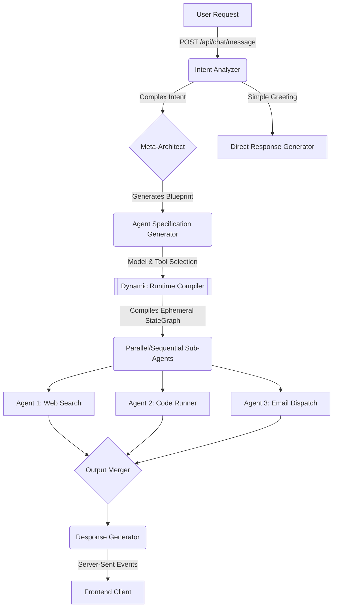

# AI Backend

A highly sophisticated, production-ready AI orchestration backend built with **Node.js**, **Express**, **MongoDB**, and **LangGraph**.

This backend does not just respond to chat messages—it acts as an autonomous AI operating system. It parses user intents, compiles a dynamic LangGraph Execution Blueprint at runtime, and spawns modular AI agents that automatically resolve dependencies to complete the task.

---

## High-Level Architecture

The system operates strictly on a **Plan-and-Execute** paradigm using a custom Meta-Graph architecture.

### Execution Pipeline

1. **Intent Analysis**: Classifies the incoming message to determine if it requires a simple conversational response or complex multi-step orchestration.
2. **Meta-Architect**: Designs the `Execution Blueprint`—a JSON structure describing all necessary tasks, tools, and dependencies required to resolve the user's intent.
3. **Agent Specification**: Generates individualized system prompts and assigns specific AI models to each task based on complexity and tool requirements.
4. **Runtime Engine (`compileRuntimeGraph.js`)**: Dynamically compiles the `Execution Blueprint` into a brand new, one-shot LangGraph `StateGraph`.
5. **Runtime Execution**: The newly compiled graph executes the spawned agents in parallel (or sequentially, based on dependencies) to compute the final result.



---

## Multi-Model Load Balancing

The orchestration engine leverages a diverse suite of LLMs configured in `MODEL_REGISTRY` to prevent API rate limits and optimize latency.

### Available Models (`src/ai/models/registry.js`)
- **GPT-120B / GPT-20B**: Primary orchestrators (Meta-Architect, Agent Specifications) and heavy tool-use runtime agents.
- **Qwen27B**: Specialized tasks requiring robust reasoning or markdown generation (e.g., `Response Generator`).
- **Allam / Llama (22m, 86m)**: Fast, toolless models used for simple generation and summarization (e.g., `Title Generator`).
- **Minimax / GPTSafeguard**: Secondary load-balanced models.

> [!NOTE]
> The orchestrator strictly avoids injecting the `submit_final_answer` tool (or any other tools) into the prompt when dispatching tasks to toolless models like Llama and Allam. Instead, these models are instructed to output raw JSON which our custom parser intercepts and sanitizes.

---

## Server-Sent Events (SSE) Streaming

The API streams real-time updates directly to the frontend over SSE.

When a message is POSTed to `/api/chat/message`, the backend consumes the `v2 streamEvents` generator from LangGraph and emits the following event types:

- `type: "status"`: Emits `"Processing [Node Name]..."` for core orchestration nodes, and `"Agent Name: [Agent Role]"` when a dynamic runtime agent fires.
- `type: "agents"`: Emits an array of agent specifications immediately after the `agentSpecificationGenerator` concludes, driving the frontend visualization.
- `type: "content"`: Emits the final markdown chunks generated by the `Response Generator`.

---

## Directory Structure

```text
src/
├── ai/
│   ├── compiler/        # Dynamic LangGraph compilation logic
│   ├── models/          # Model registry and initialization
│   ├── nodes/           # LangGraph nodes (Architect, Intent, etc)
│   ├── prompts/         # System instructions
│   ├── runtime/         # Ephemeral runtime agent execution engine
│   ├── state/           # State schemas for orchestration graphs
│   ├── tools/           # Tavily and custom tool registries
│   └── validators/      # Zod validation layers for Blueprints
├── config/              # MongoDB and Environment configurations
├── middleware/          # Express middlewares (JWT Auth, Error handling)
├── modules/             # REST endpoints (Auth, Chat, Conversations)
└── utils/               # Rate limit retry wrappers, loggers
```

---

## Installation & Execution

1. **Install Dependencies**
   ```bash
   npm install
   ```

2. **Configure Environment**
   Create a `.env` file from `.env.example` and supply your database URI and API keys (Groq, Tavily, Portkey, etc.).

3. **Start the Application**
   ```bash
   npm run dev
   ```